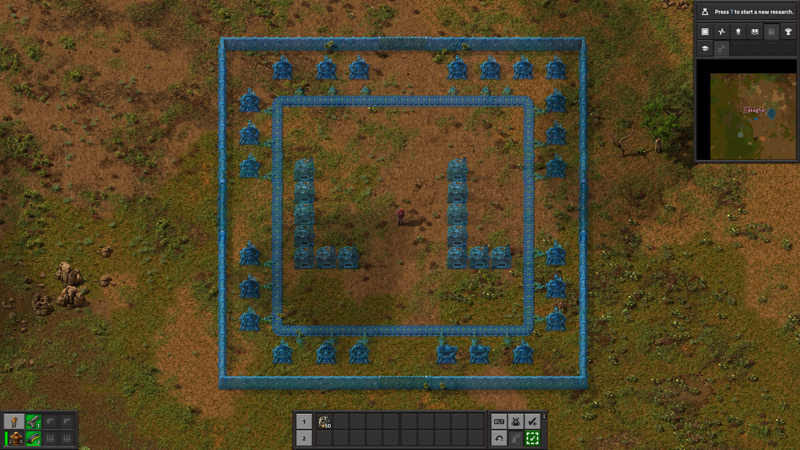
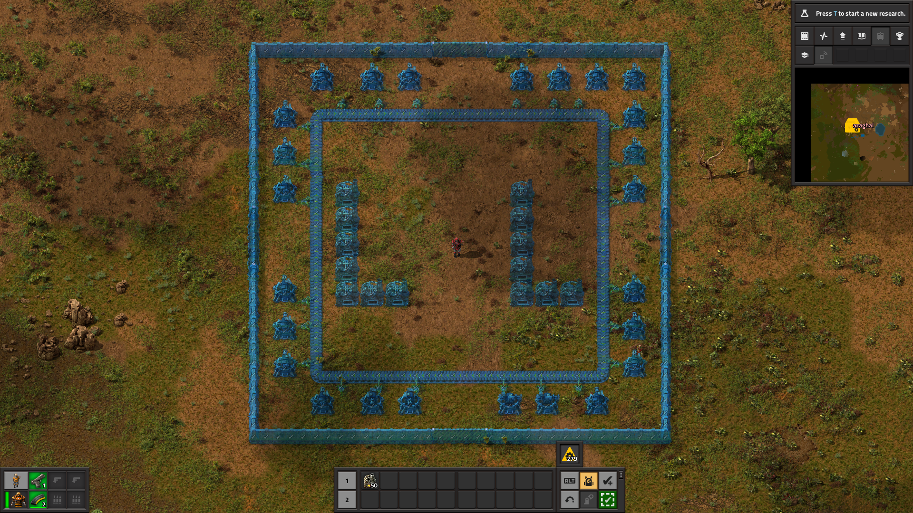
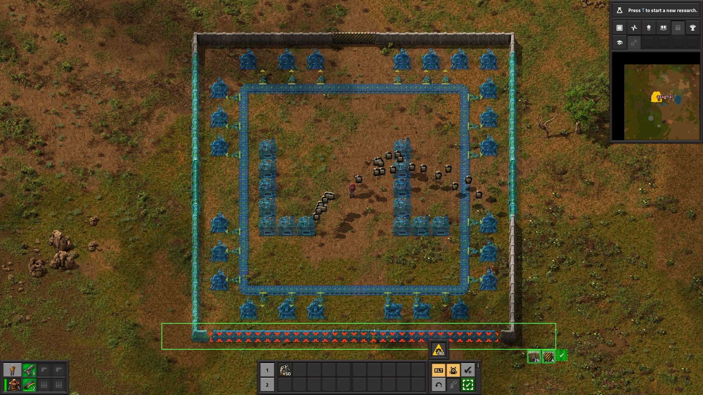
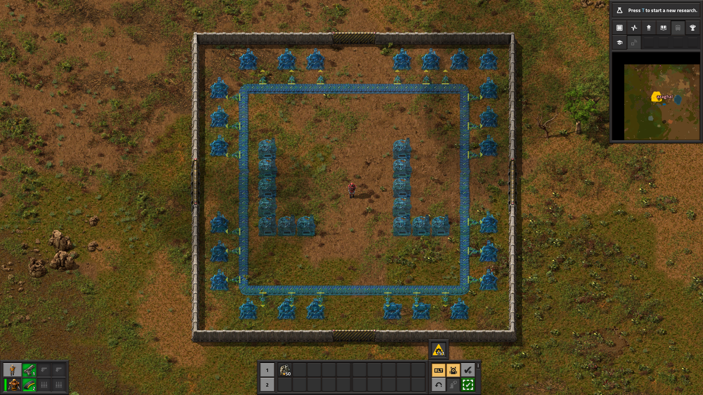
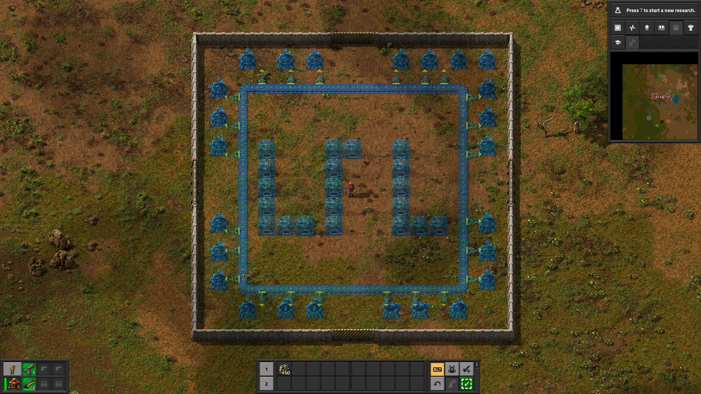
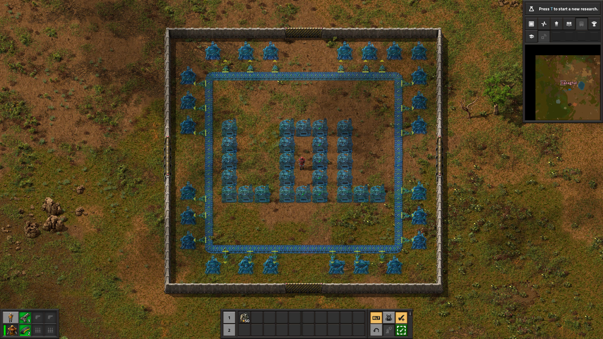
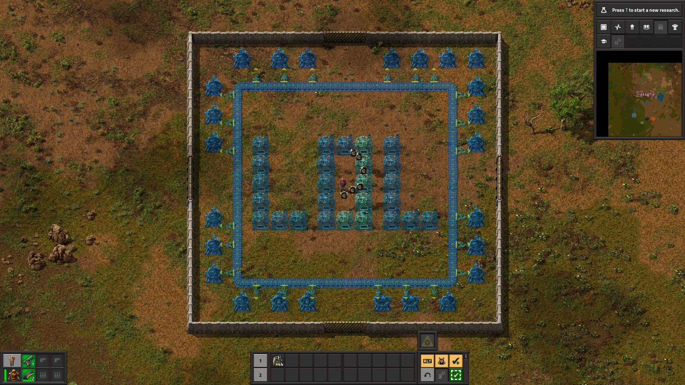

Construction Approvals Demo
===========================

About
-----

This repository contains demo (media) files for [Construction Approvals](https://github.com/azaghal/Factorio-ConstructionPlannerContinued/) (formerly known as Construction Planner Contninued) Factorio mod. The purpose of this separation is to avoid increasing the size of the main repository with the code.

Screenshots
-----------

Videos
------

<video>
  <source src="videos/00-full_demonstration.webm">
</video>

License
-------

All assets made available through this repository are released under the terms of MIT license (see the accompanying `LICENSE`) file.
